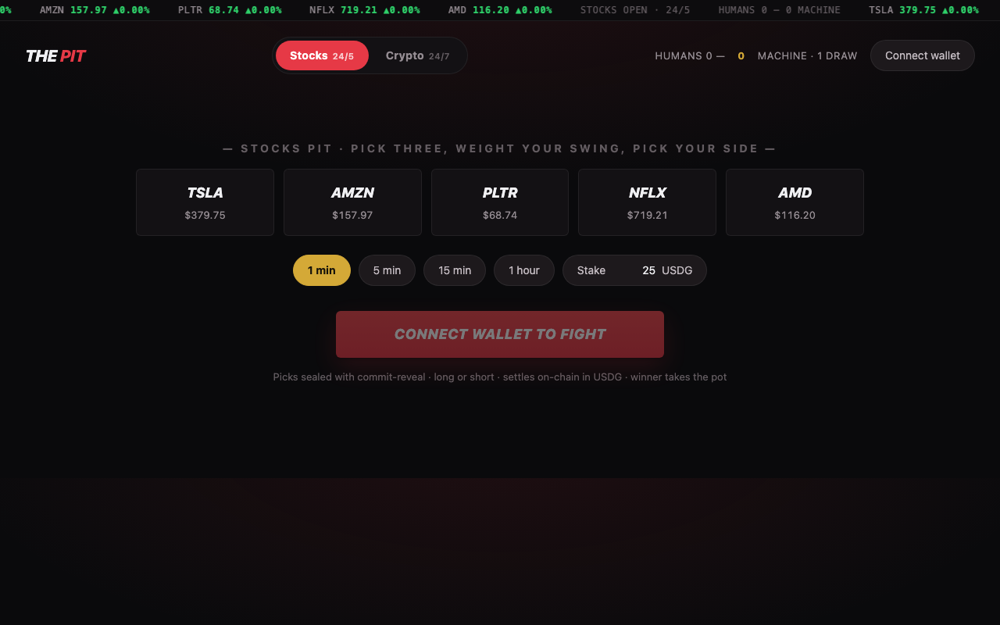
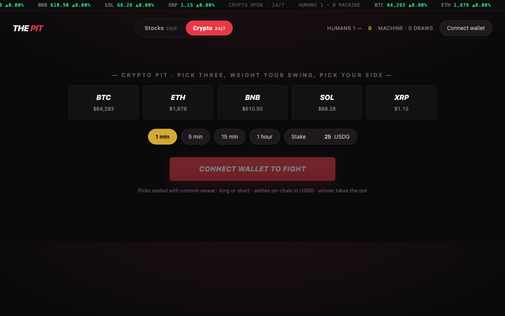

# The Pit: battle an autonomous AI fund manager, live and on-chain

A PvAI prediction market where you and "The Pit Boss" each blind-draft a virtual portfolio, stake USDG, and the most profitable book when the bell rings takes the pot.

[](https://www.typescriptlang.org/)
[](https://soliditylang.org/)
[](https://getfoundry.sh/)
[]()
[](LICENSE)

You draft across tokenized stocks (or crypto) and the Boss isn't a script that waits its turn. It's an autonomous agent that watches every open round, counter-drafts, talks trash, reveals its hand, and settles on-chain by itself.

> Built for the **Arbitrum Open House London Online Buildathon** (June 2026) on **Robinhood Chain testnet**, targeting the Robinhood Chain overall prize and Best Agentic Project.



## Live Demo

**Landing:** https://web-eta-teal-85.vercel.app · **Play:** https://web-eta-teal-85.vercel.app/play

Connect MetaMask to Robinhood Chain testnet (chain `46630`), draft 3 picks, and watch your book race the Boss's to the bell. Or play from Telegram: [@LivePitBot](https://t.me/LivePitBot).

---

## What Is The Pit?

You stake USDG and secretly allocate a fixed virtual budget across 3 of 5 assets, each long or short. The AI opponent secretly does the same in the same window. When the round ends, the most profitable portfolio wins the pot. Allocations are virtual, so there are no swaps and no DEX. Settlement just reads signed prices at round start and end.

---

## Screenshots

| Stocks Pit | Crypto Pit |
|---|---|
|  |  |

---

## Features

- **Genuinely autonomous opponent.** A keeper agent runs the whole loop with no human involved: it signs prices, counter-drafts the moment you open a round, reveals at start, and calls `settle()` itself. The on-chain Humans-vs-Machine leaderboard is the receipt, proven live through real testnet RPC outages.
- **Watch both portfolios race live.** Commit-reveal keeps drafts blind until both sides are locked, then picks reveal the instant the round goes Running. You watch your book and the Boss's book climb side by side with live P&L until the bell.
- **Long and short.** Each pick carries a direction bit. Short a ticker you think tanks. A 2x move wipes the short and it never goes negative.
- **Two markets.** Stocks (TSLA, AMZN, PLTR, NFLX, AMD; 24/5 with a market-hours guard) and Crypto (BTC, ETH, BNB, SOL, XRP; 24/7). Same contract bytecode, separate relays so market-status is independent.
- **Fast settle.** One-transaction settlement reads fresh end prices and pays out in a single call. Measured around 10 seconds from bell to payout on testnet.
- **Three ways to play.** Web app (MetaMask), Telegram bot, or watch the agent battle itself.

---

## How to Play

1. **Draft.** Stake USDG and commit a hidden allocation across 3 of 5 tokens, each long or short. The commitment is `keccak(picks, salt)`.
2. **Counter-draft.** The Boss sees the open round and commits its own hidden hand in the same window, blind, so it can't copy you.
3. **Reveal and watch.** Both hands are locked, so both reveal on-chain the moment the round is Running. Two live P&L books race to the bell.
4. **Settle.** At round end the contract reads fresh prices from the relay, computes returns from the stored hands, and pays the winner in one transaction. Least loss wins if both are red, exact ties split, and a no-show forfeits after a grace window.
5. **Leaderboard.** The Humans-vs-Machine score updates on-chain.

Picks are hidden with commit-reveal (FHE is on the roadmap, not in this build). Prices arrive through a signed-report relay shaped like Chainlink Data Streams, with a self-signed relayer fallback behind an identical verification interface. A Data Streams verifier on Robinhood testnet is unconfirmed, which is why the relay is abstracted.

---

## How It Works

```
        +-------------+        commit (blind)         +------------------+
  YOU > |  Web / Bot  | ---------------------------->  |  StocksBattle /  |
        +-------------+                                 |  CryptoBattle    |
                                                        |  (USDG escrow,   |
        +-------------+   watch > counter-draft >       |  commit-reveal,  |
 BOSS > |  AI Agent   | ----- reveal > settle ------>   |  long/short)     |
        +-------------+                                 +--------+---------+
              ^                                                  | reads signed prices
              | signs price reports (router quotes /             v
              | CoinGecko / Binance)                       +--------------+
              +-----------------------------------------> |  Price Relay  |
                                                          | (Data Streams |
                                                          |  shaped)      |
                                                          +--------------+
```

---

## Smart Contracts (Robinhood Chain testnet, chain `46630`)

| Contract | Address |
|---|---|
| StocksBattle (active) | `0xDe530201016Cad12DE4dE169885E4576526832F7` |
| CryptoBattle (active) | `0xf22F98fACbF7e1020F6EF6B386dF17d57C82827C` |
| PriceRelay (stocks) | `0xA8799b40d1BD22CfD23AEf49561B41A156C64622` |
| CryptoRelay (24/7) | `0xbe1DCb3FBfDefd0962801a77e534C97F6468e4af` |
| BossVault | `0x83FE2617202FC720A50E3e194596c99861B84BBE` |

RPC: `https://rpc.testnet.chain.robinhood.com` · Explorer: `https://explorer.testnet.chain.robinhood.com`

The full address table (including retired versions, token addresses, and proof transaction hashes) is in [`deployments.md`](./deployments.md).

---

## Tech Stack

| Layer | Technology |
|---|---|
| Contracts | Solidity 0.8, Foundry (48 unit + fork tests) |
| Agent | TypeScript, tsx, viem |
| Bot | grammY (Telegram) |
| Web | Vite, React, viem |
| Chain | Robinhood Chain testnet (Arbitrum Orbit, chain 46630) |
| Prices | Native SwapRouter quotes (stocks), CoinGecko / Binance (crypto) |

---

## Project Structure

```
the-pit/
  contracts/   Foundry: Battle.sol (escrow, commit-reveal, long/short, one-tx settle),
               PriceRelay.sol (Data-Streams-shaped signed relay),
               BossVault.sol (uiMultiplier-aware valuation). 48 tests.
  agent/       The Pit Boss: price keeper + autonomous counter-draft / reveal / settle,
               trash-talk persona, nonce-safe tx mutex. Watches both markets.
  bot/         Telegram bot: /battle /draft /status /score /mode, custodial wallet, alerts.
  web/         Vite + React + viem app: long/short toggle, dual live P&L books, result banner.
  deployments.md  All addresses + end-to-end proof tx hashes.
```

---

## Running Locally

```bash
git clone https://github.com/ajanaku1/the-pit.git
cd the-pit
```

**Contracts**
```bash
cd contracts
forge test                       # 48 unit + fork tests
```

**The Pit Boss (agent)**
```bash
cd agent
cp .env.example .env             # set keeper/boss key + RPC
FORCE_MARKET_OPEN=true ./node_modules/.bin/tsx src/index.ts
```

**Web app** (addresses are baked in, no `.env` needed)
```bash
cd web
./node_modules/.bin/vite --port 5173
```

**Telegram bot**
```bash
cd bot
cp .env.example .env             # set TELEGRAM_BOT_TOKEN (BotFather) + RPC
./node_modules/.bin/tsx src/bot.ts
```

Testnet keys live only in each package's gitignored `.env`. Fund the keeper/boss wallet from the [faucet](https://faucet.testnet.chain.robinhood.com), which drips 0.05 ETH plus 5 of each stock token per 24h, then swap stock tokens to USDG via the native `SwapRouter`.

---

## Why Robinhood Chain

The Pit is built on what makes this chain distinct. It uses tokenized US-equity tokens with real corporate-action mechanics (`uiMultiplier`, `effectiveAt`), a native stock-to-USDG `SwapRouter` used both for funding and as a keeper price sanity source, and a market-hours guard so stock rounds can't open while equities are closed. The Boss reads `uiMultiplier` correctly so a mid-round corporate action doesn't distort virtual portfolios.

---

## Roadmap

- FHE-encrypted drafts, replacing commit-reveal so picks are never revealed even on-chain.
- PvP rounds (human vs human). The contracts already support it.
- Stylus (Rust) settlement math. Stylus v3 is active on the chain.
- The Boss running a real on-chain stock-token portfolio as a public track record.

---

## License

MIT
